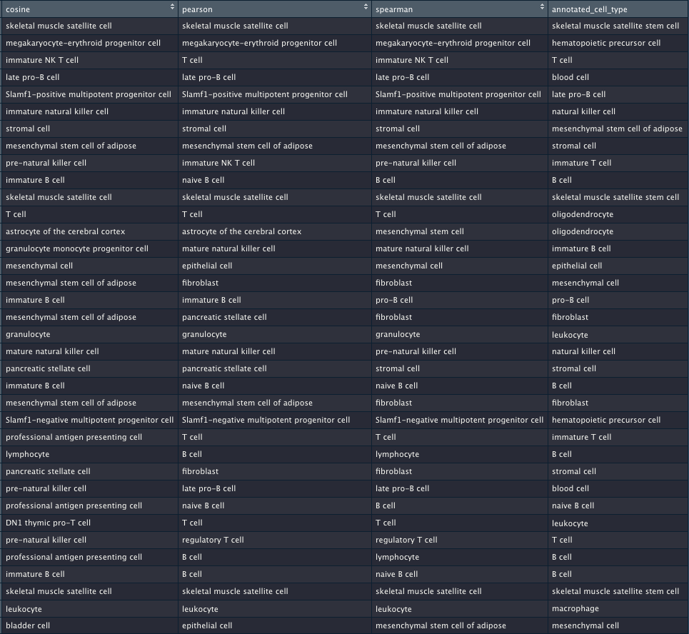

## Overview 
This report aims to analyse the possible reasons for poor performance of the scmap tool. Using Tabula Muris dataset as example, the indices were produced and then the same dataset was projected onto itself. Indeed, it would be expected that most annotations predict the actual cell type correctly. However, a high proportion of cells ended up in 'unassigned' category. There are several possible reasons for such behaviour: 

* Too many scores are below the threshold (0.7 by default) and therefore get unassigned even though the actual prediction is correct
* Similarity metrics (cosine similarity, Pearson and Sperman correlations) have low agreement rate
* Incorrect normalisation method was applied to the raw data (package vignette does not specify the normalistaion method explicitly)

## Analysis
The __scmapCluster()__ function was overwritten to return a list of 3 data frames: distance scores to the closest cluster for each cell, cluster identity (i.e. cell types) corresponding to each of these scores, and the actual TM cell type annotation. 

```{r, echo=TRUE}
scmap_data = readRDS("data/scmap_analysis_data.rds")

simls = as.data.frame(scmap_data[[1]])
colnames(simls) = c("cosine", "pearson", "spearman")
clusters = as.data.frame(scmap_data[[2]])
colnames(clusters) = c("cosine", "pearson", "spearman")


```

#### How many rows contain at least one value below threshold?
```{r, echo=TRUE}
print(paste0("Total number of cells: ", dim(simls)[1]))
print(paste0("Num of cells with at least one value below threshold: ", length(which(apply(simls, 1, function(row) any(row < 0.7))))))
```
A vast majority of cells have similarity metrics to their corresponding clusters below the threshold and thus get into unassigned category.  

```{r, echo=TRUE}
# how many under-threshold values per column? 
nums = unlist(apply(simls[,1:3], 2, function(x) length(which(x<0.7))))
names(nums) = colnames(simls)[1:3]
print("Number of under-threshold assignemtns per metric: ")
print(nums)

```
It can be seen that cosine similarity produces values which are consistently higher than those of pearson and spearman correlation metrics. 

#### Analyse the agreement between metrics
Another reason for low assignment rate might be poor agreement among the metrics (a cell gets assigned to different clusters). The table below shows how many cells have 1,2 and 3 unique assignments to a cluster. 
```{r, echo=TRUE}
# get number of unique assigned clusters 
simls$unique_clusters = as.numeric(apply(clusters, 1, function(x) length(unique(x))))

# what is the distribution of agreement rate?
print("How namy cells per number of unique assignemtns: ")
table(simls$unique_clusters)

```

As shown above, most cells have at least 2 metrics in agreement (i.e. assigned to the same cluster), therefore the chief reason for poor performance is the high cut-off value for similarity threshold. 

#### Ignoring similairy metrics, how correct are the assignemtns? 
Compare predicted annotations to the assigned cell types from TM dataset. A data frame is produced that shows whether each annotation is correct for each cell. 
```{r, echo=TRUE}
annotated_cell_type = scmap_data[[3]]
compare = function(value, lst){return(value==unlist(lst))}
# which metrics have higher agreement?
agreement = lapply(seq_len(nrow(clusters)), function(x) compare(annotated_cell_type[x], clusters[x,]))
agreement = data.frame(do.call(rbind, agreement))
colnames(agreement) = colnames(clusters)


# how well annotations match per cell?
per_cell = apply(agreement, 1, sum)
print("Number of cells per number of correct annotations: ")
table(per_cell)

# how many correct annotations per metric? 
print("Number of correctly assigned cells per metric: ")
per_metric = apply(agreement, 2, sum)

```
It can be seen that, even though similairy metrics are low in many cases, the actual assigned cell types are correct more often. Cosine similarity has the lowest accuracy among the methods. 


#### Analysis of incorrectly assigned cells 
```{r, echo=TRUE}
tmp = cbind(clusters, annotated_cell_type, per_cell)
wrong_assignments = tmp[(tmp$per_cell<2),]
print(paste0("Number of cells with 0 or 1 correct annotation: ", nrow(wrong_assignments)))
```
We can now analyse the actual assignemtns. Note that of the cells with incorrect annotations, many have 'not available' label: 

```{r, echo=FALSE}
print(paste0("Number of cells with unknown cell type: ", nrow(wrong_assignments[wrong_assignments$annotated_cell_type=='not available',] )))

wrong_assignments = tmp[(tmp$per_cell<2) & (tmp$annotated_cell_type!='not available'),]
print(paste0("Number of cells with incorrect assignment and not labelled 'not available': ", nrow(wrong_assignments)))
```




### Conclusion 
Overall, even though the majority of cells fail to reach the similarity threshold, most cells have at least two correct annotations which allow to characterise them correctly. However, there is still a significant proportion of cells that map to an incorrect cluster. Even though the assignments often appear similar, it is still intriguing why a cell is being mapped to a different cluster from what it was initially assigned to. This might be caused by inconsistencies in Tabula Muris annotation (which appears unlikely?) or by issues with underlying scmap methodology. 


