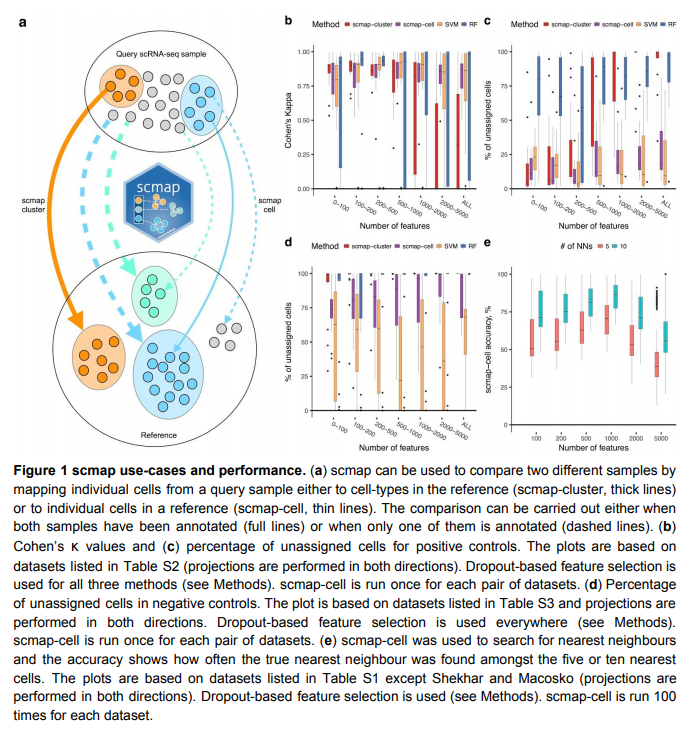
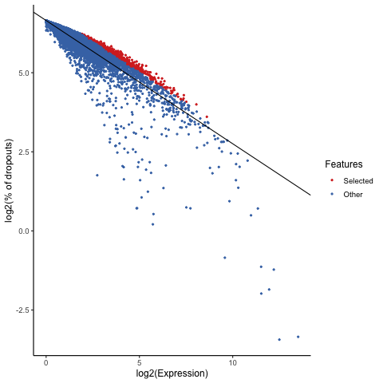
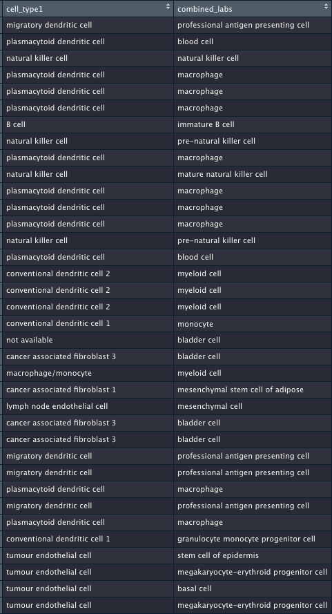

```{r setup, include=FALSE}
knitr::opts_chunk$set(echo = TRUE)
```

## Overview
Scmap is a tool used for projecting new scRNA-seq datasets onto reference datasets with available inferred cell types. Cell types correspond to the inferred clusters in the reference dataset. Each cluster is represented by a centroid (a vector of median expression values for each feature gene). To determine the cell type, a new cell is compared with clusters' centroids (scmap-cluster) or with other cells (scmap-cell) and distance metrics are calculated. The cell is then annotated with a cell type from the 'closest' cluster.    





**Workflow**: 

* parse normalised 10X matrix and SDRF for Tabula Muris dataset (smart-seq2) into SCE object\n 
* run scmap-cli workflow to obtain feature genes\n 
* build an indexed version of TM dataset\n 
* parse projection dataset into SCE object and project onto TM index\n

   


In order to be assigned to a cluster, a cell needs to score above a specified threshold on 3 distance metrics - Spearman and Person correlation coefficients and cosine similarity. At least two of the similarity assignments need to agree with each other, otherwise a cell is marked as 'unassigned'.    

### Sanity check: projecting the Tabula muris dataset onto itself 
To check consistency of the method, a model was trained on TM dataset (split into 70/30 ratio for training and testing). Index was built for training dataset and test dataset was projected on it. Whereas the provided annotation had 1769 cells without annotation (~10% of test data set), the predicted cell types lacked annotation for 6951 cells (~45% of the cells), indicating that the tool is likely to be too stringent with annotation threshold. 

## Results 
For 5 Mus Musculus datasets from Single Cell expression Atlas, projections were made on cluster and cell levels.   

1. [**Aging/immune stimulation dataset**](https://www.ebi.ac.uk/gxa/sc/experiments/E-MTAB-4888/results/tsne)

* technology type: 'smart-like'   


```{r, echo=FALSE}
library(SingleCellExperiment)
library(scmap)
library(Seurat)

aging_immune = readRDS("data/aging_immune.rds")

```
n = 2315 cells; 75 assigned a cell type   

Inferred cell types:

```{r, echo=TRUE}
table(aging_immune$cell_type1)

```
\newline
* Cluster-level projection:
```{r, echo=TRUE}
table(aging_immune$combined_labs)

```

* Cell-level projection:
```{r, echo=FALSE}
aging_immune_cell = readRDS("data/aging_immune_cell.rds")
```

```{r, echo=TRUE}
table(aging_immune_cell$combined_labs)

```

2. [**Lin-cells dataset**](https://www.ebi.ac.uk/gxa/sc/experiments/E-MTAB-6677/results/tsne)     

* Technology type: 10xV2 

All cells assigned the same type (n=3169):    

```{r, echo=FALSE}
lin_cells_cluster = readRDS("data/lin_cells_cluster.rds")

```

```{r, echo=TRUE}
table(lin_cells_cluster$cell_type1)

```
* Cluster-level projections:
```{r, echo=TRUE}
table(lin_cells_cluster$combined_labs)

```

* Cell-level projections: 
```{r, echo=FALSE}
lin_cells_cell = readRDS("data/lin_cells_cell.rds")
```

```{r, echo=TRUE}
table(lin_cells_cell$combined_labs)

```

NB: proportion of unassigned cells significantly increases. However, accuracy appears to increase.

3. [**Melanoma infiltration dataset**](https://www.ebi.ac.uk/gxa/sc/experiments/E-EHCA-2/results/tsne)     
* Technology type: smart-seq2 
Inferred cell types (n=6423):   
```{r, echo=FALSE}
mel_sce_cluster = readRDS("data/mel_sce_cluster.rds")
```

```{r, echo=TRUE}
table(mel_sce_cluster$cell_type1)

```
* Cluster-level projections: 
```{r, echo=TRUE}
table(mel_sce_cluster$combined_labs)

```

* Compare assigned and predicted cell types for individual cells: 



* Cell-level projections 
```{r, echo=FALSE}
mel_sce_cell = readRDS("data/mel_sce_cell.rds")
```

```{r, echo=TRUE}
table(mel_sce_cell$combined_labs)

```

4. [**Lamina propria macrophages**](https://www.ebi.ac.uk/gxa/sc/experiments/E-MTAB-6976/results/tsne)     

* Technology type: 10xV2

* Inferred cell types (n=786): 

```{r, echo=FALSE}
LP_macrophages_cluster = readRDS("data/LP_macrophages_cluster.rds")
```

```{r, echo=TRUE}
table(LP_macrophages_cluster$cell_type1)

```
* Cluster-level projections: 
```{r, echo=TRUE}
table(LP_macrophages_cluster$combined_labs)

```

* Cell-level projections: 
```{r, echo=FALSE}
LP_macrophages_cell = readRDS("data/LP_macrophages_cell.rds")
```
```{r, echo=TRUE}
table(LP_macrophages_cell$combined_labs)

```

5. [**Transcriptional burst kinetics dataset**](https://www.ebi.ac.uk/gxa/sc/experiments/E-MTAB-7098/results/tsne)    
* Technology type: smart-seq2
* Inferred cell type (n=466) 
```{r, echo=FALSE}
tb_cell = readRDS(file = "data/tb_cell.rds") 
```
```{r, echo=TRUE}
table(tb_cell$cell_type1)

```
* Cluster-level projections: 
```{r, echo=FALSE}
tb_cluster = readRDS("data/tb_cluster.rds")
```
```{r, echo=TRUE}
table(tb_cluster$combined_labs)
```


* Cell-level projections: 

```{r, echo=TRUE}
table(tb_cell$combined_labs)

```


## Conclusion

In general, the results demonstrate that the vast majority of projected cells end up in the 'unassigned' category. However, when cells are assigned to a cell type, assignment appears to be similar to the provided cell type for the majority of cells. There are several possible reasons for low assignment rate:    

* Result might depend on sequencing tech used (e.g. for lin-cells dataset proportion of assigned cells is high)
* Inferred cell types in the atlas datasets might be incorrect
* Changing parameters of scmap might yield better results, however, that might come at the cost of reduced accuracy

In the further steps of the project, it is planned to assess the influence of technology type on the cell type prediction accuracy and analyse possible methods for improving annotation consistency (e.g. by mapping the cell type to Cell Ontology using Zooma). 


